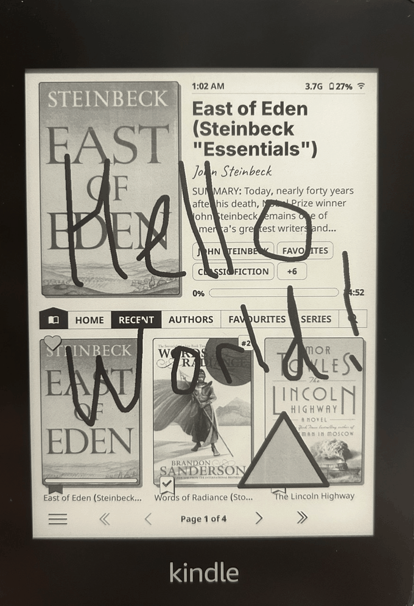
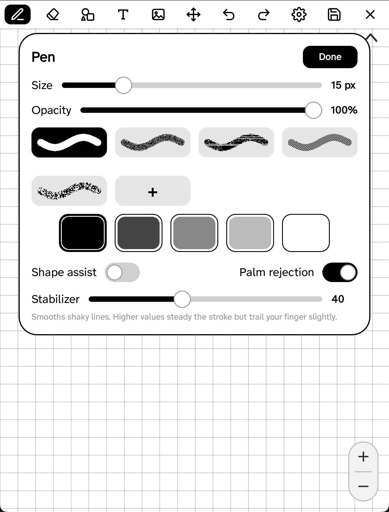
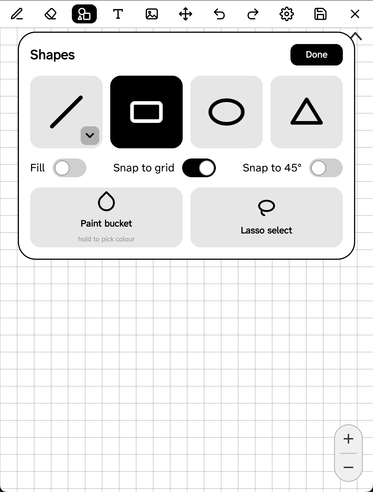
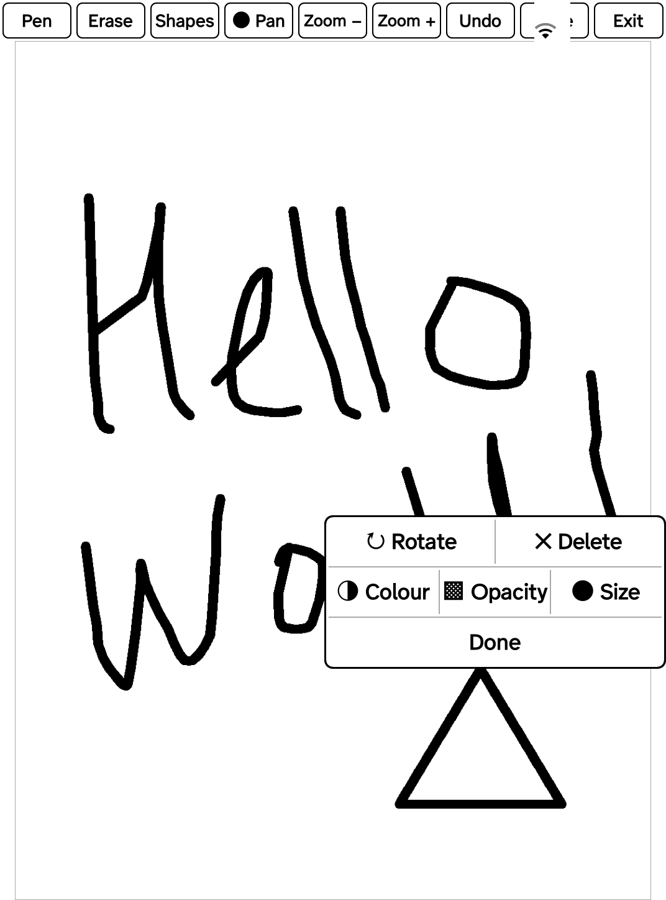
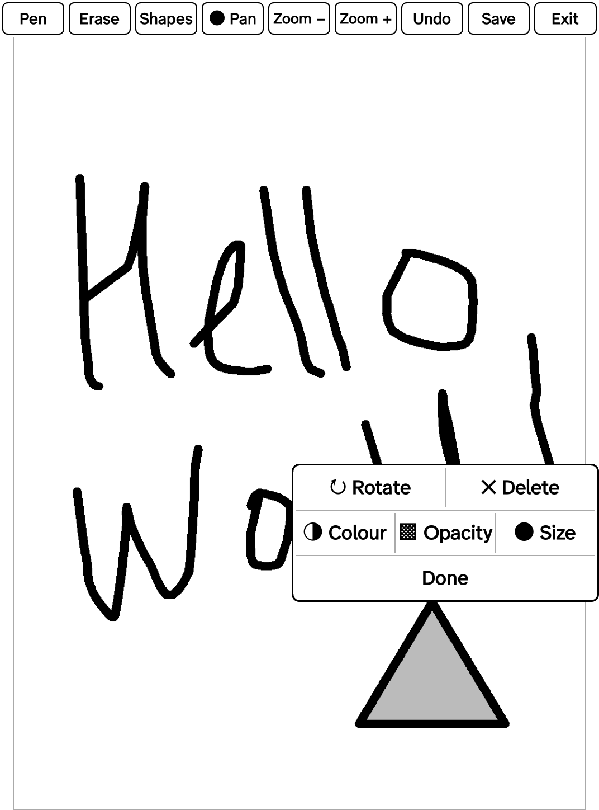
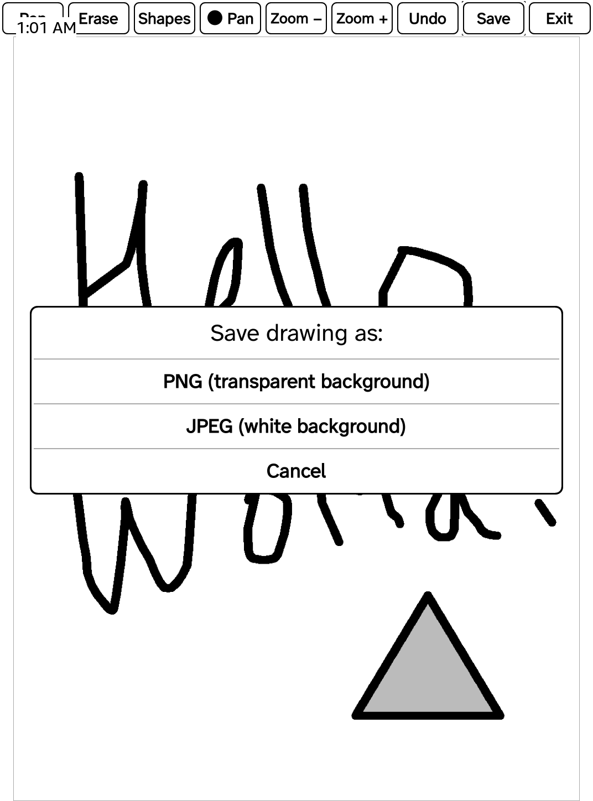

# Ink Away

A small finger drawing canvas for KOReader, made for e-ink readers like the Kindle and Kobo.

Open a blank page, draw with your finger, and save the result as a PNG with a real transparent background, or as a JPEG on white, at the exact pixel size of your screen. The transparent PNG is the whole point: it lets you draw your own sleep screen covers and overlays that sit cleanly on top of anything.



Ink Away is meant to stay simple and focused. You get a pen with adjustable size, opacity, and shade or colour; shapes; a paint bucket; an eraser; undo; zoom and pan; and save. There are no layers, no text, and no networking.

## Features

- A blank fullscreen canvas at your screen's resolution.
- Finger drawing with smooth, continuous lines. It copes with the brief moments when a touch panel loses contact, so your lines don't break apart.
- A pen with adjustable thickness, opacity, and colour (grey shades on every device, full colour on colour screens), plus a **style**: ink, charcoal, acrylic, hatch, or stipple.
- A **stabilizer** that smooths finger wobble into clean lines, with an adjustable strength so you can tune it to your hand.
- Re-openable **projects**: save an editable drawing and come back to it later. Optional **autosave** (off, on exit, or every few minutes) restores your last session when you reopen.
- **Undo and redo**.
- An optional **grid** (square, dots, ruled lines, isometric, or rule of thirds) with snapping, and a snap-to-45° for straight lines.
- Shapes: straight line, curve, rectangle, ellipse, and triangle, each filled or outline, using the pen's size, opacity, and colour. You place a shape by dragging, and it stretches to follow your finger like a paint program. Hold a placed shape to rotate, recolour, resize, restyle its opacity, or delete it.
- A paint bucket that fills an enclosed area with one tap, in the current shade or colour and opacity.
- An eraser with an adjustable size that takes ink away rather than painting white over it (see Transparency below).
- Undo, one step for each time you lift your finger.
- Smooth zoom, in even steps from "whole page" up to 8×, with panning for close work.
- Save as a transparent PNG or a white JPEG, always at the exact canvas size.
- Pick the folder and file name with KOReader's own file browser.
- Made with e-ink in mind: it repaints only the part of the screen that changed, keeps one screen buffer around, and builds the big export image only while it is saving.

## Screenshots

The pen's size, opacity, and shade or colour, in one place:



Shapes (line, curve, rectangle, ellipse, triangle, filled or outline) and the paint bucket:



Hold a shape in Pan mode to rotate, recolour, resize, change its opacity, or delete it:



The paint bucket fills an enclosed area in one tap (here a triangle filled grey):



Save as a transparent PNG or a white JPEG:



## Requirements

KOReader, any reasonably recent build. Ink Away only uses KOReader's own APIs and the image encoders that already ship with it, so there is nothing else to install on the device.

## Installation

1. Get the `ink-away.koplugin` folder, either from a release archive or from this repository.
2. Copy the whole `ink-away.koplugin` folder into KOReader's `plugins` directory, so the path ends up like this:
   - Kindle: `koreader/plugins/ink-away.koplugin/`
   - Kobo: `.adds/koreader/plugins/ink-away.koplugin/`
   - Android: `koreader/plugins/ink-away.koplugin/` in app storage
   - Desktop: `plugins/ink-away.koplugin/` next to the binary

   The folder needs to hold `main.lua` and `_meta.lua` directly. Make sure it is not nested inside a second `ink-away.koplugin` folder.
3. Restart KOReader.

## Opening it

Open the top menu, go to the Tools tab (More tools), and tap "Ink Away (drawing canvas)". You can also assign it to a gesture in KOReader's gesture manager; the action is called "Open Ink Away".

## Using it

A thin toolbar runs across the top and the rest of the screen is your canvas. A faint frame shows exactly what will be exported.

- **Pen**: draw with your finger. Tap for a dot, drag for a line. Tap Pen again while it is already the active tool to open its settings: size, opacity, a row of grey shades, and, on colour screens, a row of colours.
- **Shapes**: tap Shapes to choose a shape (line, curve, rectangle, ellipse, or triangle, filled or outline). Then drag on the canvas: the first touch is one corner, and the shape stretches to follow your finger until you lift. For the curve, drag once to set the line, then drag again to bend it. Shapes use the pen's current size, opacity, and colour. To edit a shape you have already drawn, switch to the **Pan** tool and hold on the shape: a small menu opens beside it where you can rotate it (drag to spin it freely), recolour it, change its size or opacity, or delete it. This only works in Pan mode, so a hold never clashes with drawing in the pen or shape tools.
- **Fill (paint bucket)**: in the Shapes menu, choose "Fill area", then tap inside an enclosed region and it fills up to the surrounding lines. If the outline has a gap the fill spreads through it, the same as a paint program. The bucket keeps its own colour and opacity: hold "Fill area" in the Shapes menu to set them, so you do not have to change the pen each time.
- **Eraser**: the same gesture, but it removes ink. Tap Eraser again while it is active to set its size.
- **Pan**: drag with one finger to move around, which helps when you are zoomed in. You can also pan with two fingers at any time, whatever tool is selected. The canvas follows your finger, so dragging right moves the drawing right.
- **Zoom**: each press changes the zoom by a fixed factor (1.5×), between the level where the whole page fits and 8×. Zooming only changes what you see. It never changes the size of the exported image.
- **Undo**: remove the last stroke, one step for each time you lifted your finger. Undoing an eraser stroke brings back the ink it had removed.
- **Save**: choose PNG or JPEG, pick a folder, name the file, and it is written.
- **Exit**: leave the canvas. If you have unsaved work it asks first.

- **Settings (gear)**: the gear button opens redo, project actions (new, open, save), the grid and snapping toggles, the stabilizer strength, and the autosave mode.

To edit a placed shape, switch to **Pan** and hold it (see Shapes above). Hold **Fill area** in the Shapes menu to set the bucket's own colour and opacity.

Autosave and projects are separate from the image export: a project keeps your editable strokes so you can keep drawing later, while Save writes a finished PNG or JPEG. Autosave defaults to saving once when you leave (gentle on battery); set it to off or to an interval of a few minutes in the gear menu.

### Zoom, pan, and the canvas size

The canvas is a fixed image the size of your screen, for example 1072 × 1448 on some Kindles. Zooming in just lets you work on fine detail. The image underneath stays the same size, and each stroke keeps the thickness and position it had no matter what zoom you drew it at. Zooming to 200% does not give you a double sized export. The export is always the fixed canvas size.

## Transparency (PNG)

The PNG has a real alpha channel. Every pixel you did not draw on is fully transparent (alpha 0), and the ink is opaque. It is not a white image pretending to be transparent. The untouched areas are genuinely empty, so the PNG sits straight on top of a sleep screen or any other background.

This is also why the eraser removes ink instead of painting over it: erased spots go back to being transparent, just as if you had never drawn there.

If you turn the pen's opacity down, that ink is saved partly transparent (a stroke at 40% opacity ends up around alpha 102), which is handy for faint, ghosted overlays. The opacity is even across a whole stroke, so a stroke that crosses itself will not go darker where it overlaps.

## JPEG

JPEG cannot store transparency, so a JPEG export lays your ink over a solid white background. Like the PNG, it is saved at the exact canvas size. Reach for JPEG when you want an ordinary opaque image, and PNG when you want an overlay.

## Where files go

The first time it runs, Ink Away creates an "ink away drawings" folder inside your KOReader folder and uses it as the default place to save, so you don't have to hunt for a folder. You can still pick any destination when you save, and it remembers the last folder you used (across sessions) so the picker starts there next time. You type the file name and the right extension is added. If a name already exists it is overwritten, so choose a new name to keep both.

## Device compatibility

Ink Away asks KOReader for the current screen size and makes the canvas match, so no device model is written into the code and the export always matches your screen. If you rotate the device while the canvas is open, the view rearranges itself for the new orientation, and the export keeps the pixel size it had when you first opened the canvas.

## Known limitations

- Black ink draws and refreshes noticeably faster on screen than greys or white. E-ink panels switch between pure black and white in a single quick pass, while a grey (or a low opacity, which shows as grey) needs extra waveform passes to settle, so it is slower and can leave a little ghosting. This is only about on-screen speed; the exported image is unaffected.
- On a grey e-ink screen the colour row is hidden, since the panel cannot show colour; you get the grey shades instead. A colour you pick on a colour device still exports in colour.
- A white pen is invisible on the white working canvas. It only makes sense for the exported overlay.
- While you draw, the screen uses a fast refresh that flashes very little, which can leave a little ghosting behind. It is tidied up when you lift your finger, and some ghosting over a long session is just how e-ink behaves; a full refresh clears it.
- To keep a line in one piece when the touch panel drops contact for a moment, a finished stroke stays open for a fraction of a second. A fresh touch very close by within that moment counts as the same stroke.
- Panning a heavily drawn canvas at high zoom has to repaint the visible ink, so it can feel a little slow on weaker devices.
- If you rotate while drawing, the export keeps its original size and existing strokes are not rescaled to the new orientation.

## Credits and license

Ink Away is released under the MIT License (see [`LICENSE`](LICENSE)).

PNG and JPEG encoding rely on the image libraries that ship with KOReader (lodepng and libjpeg-turbo). KOReader provides them, and they are not bundled with this plugin.

## Development

The drawing logic lives in `ink/` and, apart from the view layer, does not depend on KOReader, so you can test it on your computer with LuaJIT:

```
luajit tests/run.lua
```

`tests/core.lua` covers the geometry, the rasterizer, the canvas model, and, with real FFI, the transparent and opaque export buffers. `tests/view.lua` runs the view against a small mock KOReader environment and checks that nothing paints outside the buffers at several screen sizes. `tests/preview.lua` writes sample PNGs so you can look at the export without a device.
