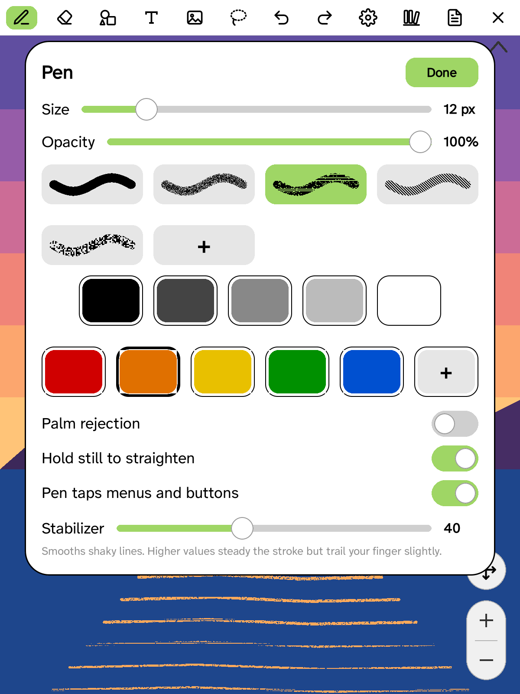
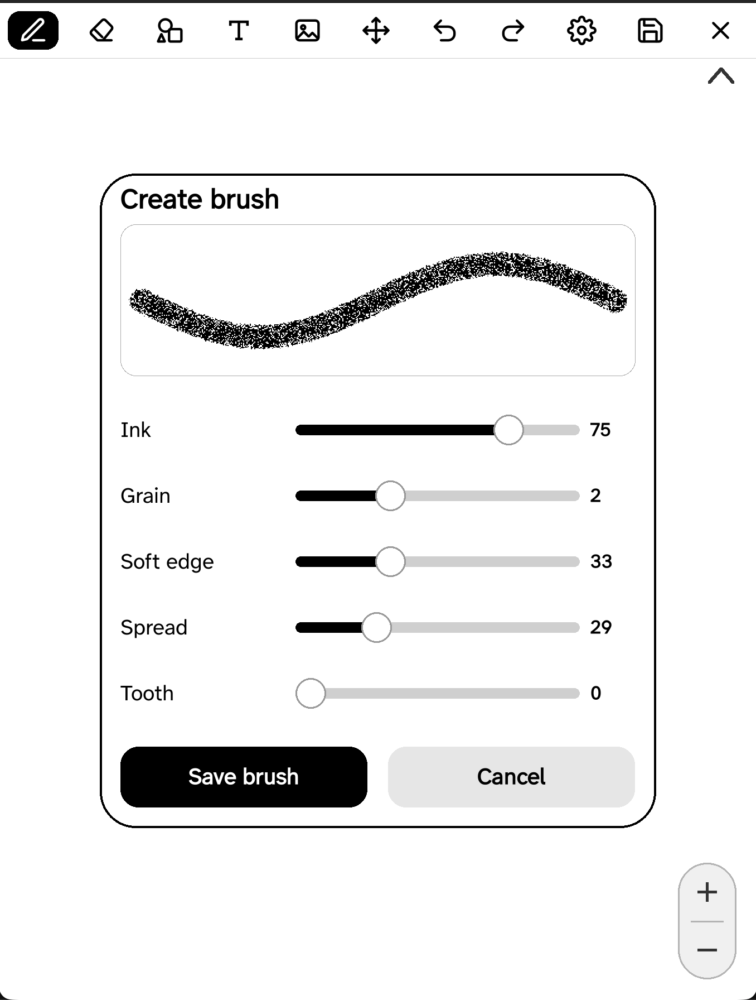
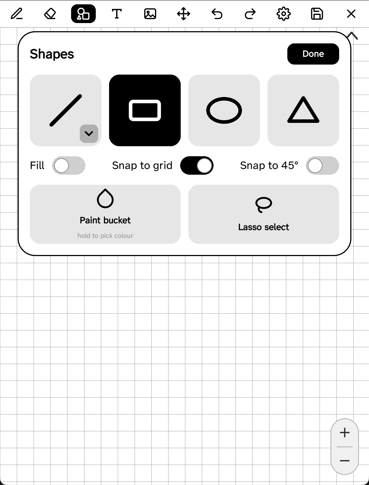
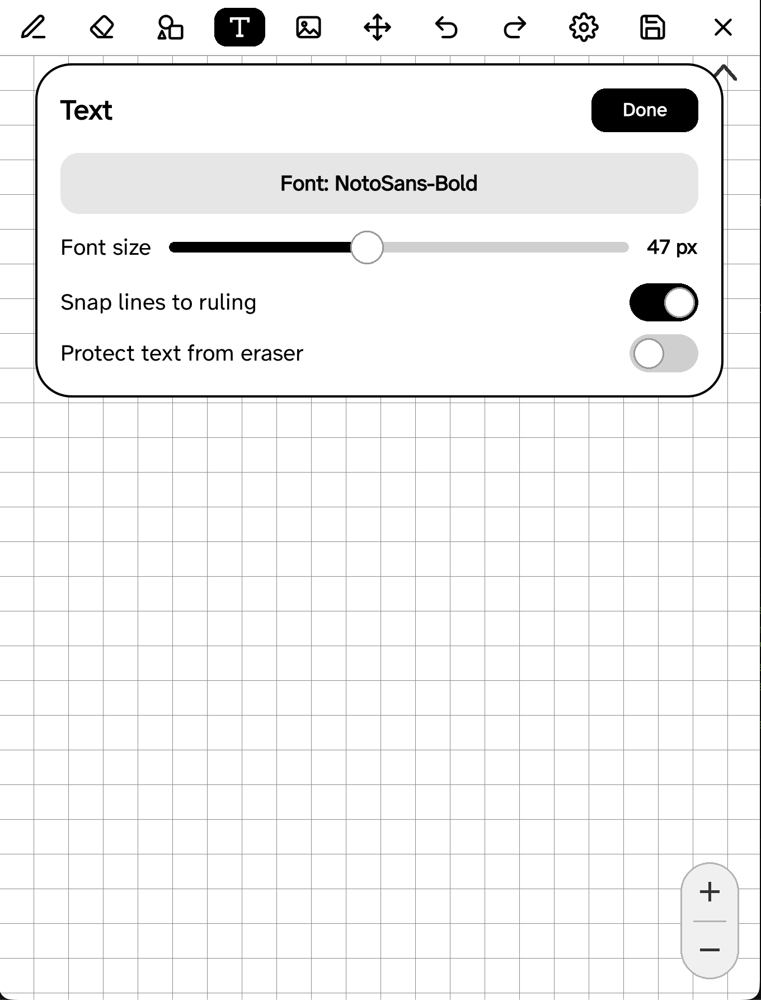
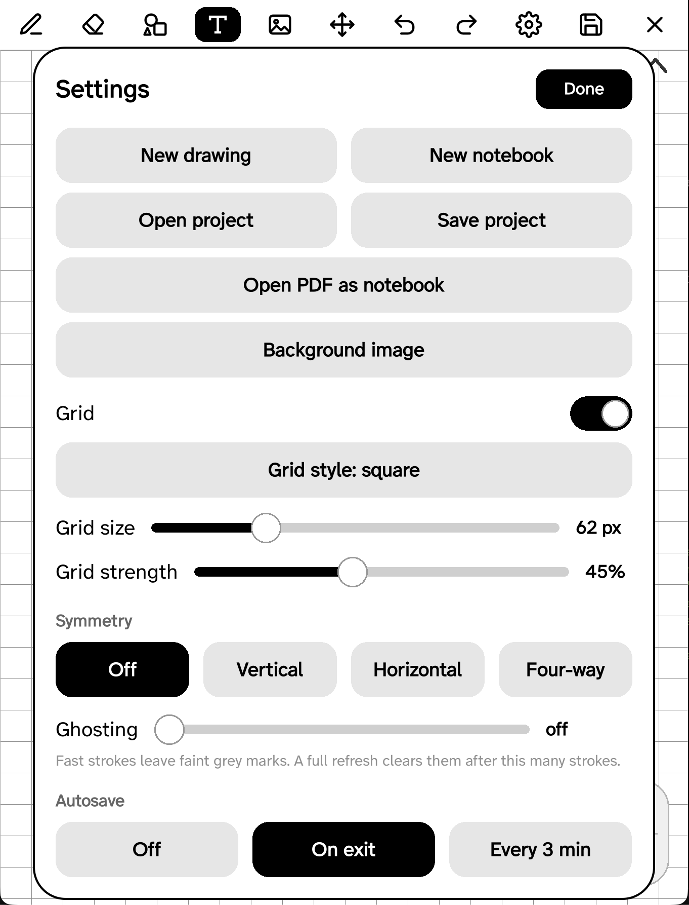
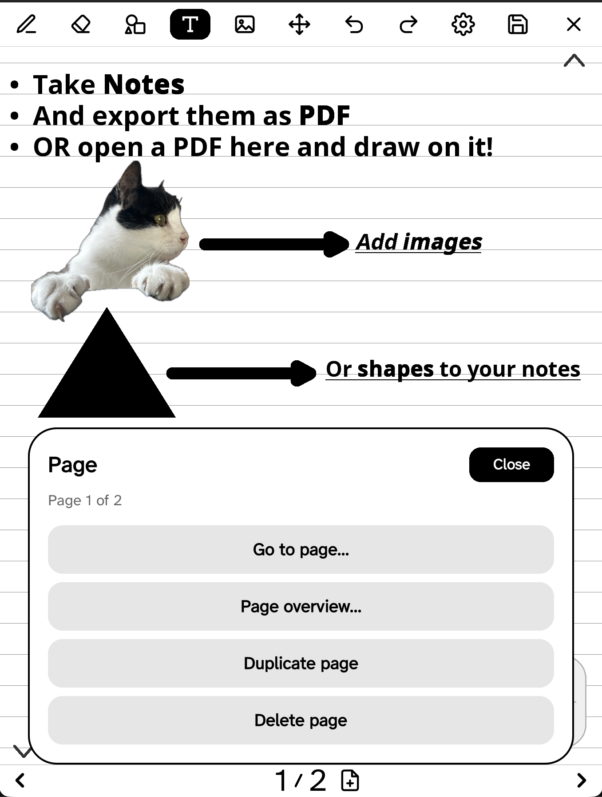

# Ink Away

A **drawing** & **note-taking** app for KOReader, with **palm rejection** for stylus users. Draw or write with finger or stylus, take notes across a notebook, or annotate any PDF. You can export a transparent or white PNG, or a paged PDF, at your exact screen size. 

## Screenshots

<table>
  <tr>
    <td width="33%" valign="top"> The pen: size, opacity, brush style and shade, with palm rejection.</td>
    <td width="33%" valign="top"> Design your own brush while a sample stroke redraws live.</td>
    <td width="33%" valign="top"> Shapes and arrows, a fill toggle, snapping, paint bucket and lasso.</td>
  </tr>
  <tr>
    <td width="33%" valign="top"> Typed text with any installed font, sizing and ruling snap.</td>
    <td width="33%" valign="top"> Notebooks, open a PDF to annotate, grid, symmetry and autosave.</td>
    <td width="33%" valign="top"> A notebook page with handwritten notes, an image and shapes.</td>
  </tr>
</table>

## Features

- **Pen**: size, opacity, color (greys everywhere, full color + a wheel on color screens) and brush styles (you can make your own brushes too).
- **Shapes & arrows** (line, curve, rectangle, ellipse, triangle, filled or outline), plus a **paint bucket** for one-tap fills. Or draw one by hand and hold the pen still at its end: it snaps into a clean line, rectangle, ellipse or triangle (Hold still to straighten, in the pen settings; writing is left alone).
- **Eraser** that removes ink (back to transparent) instead of painting white, or whole strokes at a time.
- **Text boxes**: any installed font, bold/italic/underline/highlight, sizes and lists.
- **Selection**: loop anything with the lasso (pen writing, shapes, fills, pictures, text boxes), or touch or hold a shape or picture with Pan. Drag it to move it, drag a corner to resize it (lines grow with it) and the round handle to turn it. Its menu, beside it: cut, copy and paste on any page of any notebook or drawing, duplicate, a quarter turn, mirror, to front, colour, opacity and size, delete, and Convert to text for writing. Text boxes stay upright and readable. Four-way **symmetry**, and a **background image** to draw over.
- **Palm rejection**: rest your hand, only the pen draws (on by default on Kindle Scribe / reMarkable). The pen can still tap the toolbar and menus.
- **Papers and planners**: notebooks come blank, lined, grid, dotted, isometric, margin ruled or Cornell, or as layouts and planners: handwriting practice, checklist, two columns, storyboard, music, daily, weekly, week columns, monthly, meeting notes and habit tracker. All follow the line spacing and strength you set, and drawings can use the same pages as a guide (Settings → Grid). New drawings start plain.
- **Handwriting to text**: lasso printed writing and choose "Convert to text": it becomes a text box in your current text style (one undo brings the writing back). English letters and digits, read on the device by a small model; nothing is sent anywhere.
- **Gestures**: tap with two fingers to undo, and tap twice quickly with two fingers to redo; swipe sideways with two fingers to turn a notebook's page; a long two-finger swipe up opens Browse in a notebook, or the Library from a drawing; pinch to zoom and drag with two fingers to move around; hold Prev or Next in the bottom bar to jump to the first or last page. With palm rejection on, "Finger on the page" in the pen settings decides what a finger does while the pen writes: Navigate (drag to scroll, swipe to turn pages, hold a picture or shape for its menu) or Nothing. A finger never draws then, so a resting hand can't either.
- **Notebook mode**: Keep a notebook with as many pages (lined/grid/dotted/Cornell) as you want, or open any PDF and write on it; export to a paged PDF, where titled pages become bookmarks. A whole folder can be exported as one PDF too, subfolders included, bookmarked by folder, notebook and titled page. Pages can have titles and stars, their own paper, and be moved, inserted or duplicated; save a page as a template (a planner, a meeting sheet) and start new pages from it. The overview (one tap away in the bottom bar) shows a folder like a binder: its subfolders and notebooks as coloured tabs (a folder tab goes into it, the back arrow goes up), the pages of the chosen notebook, a starred-only filter, and moving or copying pages to any notebook in any folder.
- **Links and contents**: select anything and choose "Link to page…" to make it lead to a page of this notebook or any other; a tap with Pan (or a navigating finger) follows it, and a Back pill brings you back. "Make a contents page" in the page menu lists the titled pages, each line a link, and updates later. Links stay links in exported PDFs.
- **Search**: the magnifier in the Library and in Browse finds folders, notebooks, drawings and page titles. Tick "Also look inside pages" to search the typed text on pages too, handwriting turned into text included. It runs only when you ask, a tap on its progress bar stops it, and it remembers what it read, so the next search is quick.
- **Library**: every drawing and notebook is a file that saves itself as you go. Browse them by thumbnail, sort them into folders, rename, move, duplicate or delete them, all without a computer. Deleted notebooks, drawings, folders and pages wait in the trash (Library → ⋯ → Trash) for 30 days and go back exactly where they were: a notebook with all its pages, a page between the pages it sat between.
- **Theme color** (color screens): pick a color on the same wheel as the pen, and the buttons, selected tiles, switches and active tool take it instead of black. Text on them turns black or white, whichever reads better.
- Undo/redo, zoom & pan, and an optional grid.
- And more!

Toolbar: Pen, Eraser, Shapes, Text, Image, Lasso, Undo/Redo, Settings, Library, File (rename, duplicate, export, new drawing, new notebook) and Exit. Zoom is the floating +/− control in the corner, with the Pan button just above it: tap it to pan, tap it again to go back to the tool you had.

## Installation

Copy the whole `ink-away.koplugin` folder into KOReader's `plugins` directory:

- Kindle: `koreader/plugins/ink-away.koplugin/`
- Kobo: `.adds/koreader/plugins/ink-away.koplugin/`
- Android: `koreader/plugins/ink-away.koplugin/` in app storage

Then restart KOReader. Open from Top menu → **Tools** tab → "Ink Away (drawing canvas)" near the top. You can also map it to a gesture in KOReader's gesture manager; the actions are "Open Ink Away" and "Ink Away library". 

## Notes

- Palm rejection needs KOReader 2026.07+.
- Drawings and notebooks are kept in an "ink away" folder and saved automatically; exported PNGs and PDFs go to "ink away/exports" unless you pick another folder. Work from older versions' "drawing projects" and "notebook projects" folders moves into the "ink away" folder on the first start.
- Settings → "When Ink Away opens" picks what you see first: the last document, the library, or Notebooks (the notebook browser on your last notebook, for note-taking).
- On e-ink, black ink refreshes faster than greys/white and a white pen is invisible on the white canvas, exports are unaffected.

## License

MIT (see [`LICENSE`](LICENSE)). PNG/JPEG use KOReader's bundled lodepng and libjpeg-turbo.